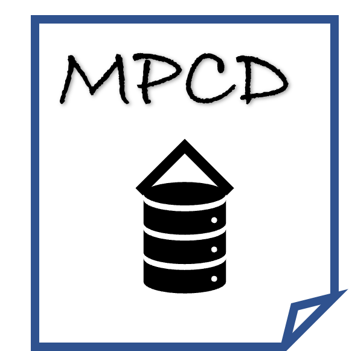

# MPCD
### Benchmark  of molecular property cliff datasets (MPCD) 

------
## 1.Low-sample size and narrow-scaffold inhibitors: [LSSNS](https://bidd-group.github.io/MPCD/dataset/LSSNS/info/LSSNS.html)

| Idx| Dataset   | Target                                      | Target\_type  | Compounds | Reference                                |
|---:|:----------|:--------------------------------------------|:--------------|-------:|:--------------------------------------------|
|  0 | usp7      | Ubiquitin carboxyl-terminal hydrolase 7     | Protease      |     45 | CHEMBL4251701                               |
|  1 | rip2      | Serine/threonine-protein kinase RIPK2       | Kinase        |     46 | CHEMBL4266012; CHEMBL4130524                |
|  2 | phgdh     | D-3-phosphoglycerate dehydrogenase          | Other Enzyme  |     51 | CHEMBL4373702                               |
|  3 | klk5      | Kallikrein 5                                | Protease      |     65 | CHEMBL4387717; CHEMBL4422656; CHEMBL4396973 |
|  4 | plk1      | Serine/threonine-protein kinase PLK1        | Kinase        |     73 | CHEMBL4406868; CHEMBL4138231                |
|  5 | ido1      | Indoleamine 2,3-dioxygenase                 | Other Enzyme  |     78 | CHEMBL4364294                               |
|  6 | rxfp1     | Relaxin receptor 1                          | GPCR          |    117 | CHEMBL3714716                               |
|  7 | braf      | Serine/threonine-protein kinase B-raf       | Kinase        |    128 | CHEMBL3638563                               |
|  8 | notum     | Palmitoleoyl-protein carboxylesterase NOTUM | Other Enzyme  |    128 | CHEMBL4619806; CHEMBL4334426                |
|  9 | mglur2    | Metabotropic glutamate receptor 2           | GPCR          |    244 | CHEMBL3886984                               |

## 2.Higher-sample size and mixed-scaffold inhibitors:HSSMS

| Idx | Dataset          | Code   | Target                                           | Type | Target\_type | Compounds | Cliffs |
| --- | ---------------- | ------ | ------------------------------------------------ | ---- | ------------ | --------- | ------ |
| 1   | CHEMBL4792\_Ki   | OX2R   | Orexin receptor 2                                | Ki   | GPCR         | 1471      | 763    |
| 2   | CHEMBL4616\_EC50 | GHSR   | Ghrelin receptor                                 | EC50 | GPCR         | 682       | 330    |
| 3   | CHEMBL244\_Ki    | FX     | Coagulation factor X                             | Ki   | Protease     | 3097      | 1350   |
| 4   | CHEMBL237\_EC50  | KOR    | Kappa opioid receptor                            | EC50 | GPCR         | 955       | 400    |
| 5   | CHEMBL3979\_EC50 | PPARd  | Peroxisome proliferator-activated receptor delta | EC50 | NR           | 1125      | 467    |
| 6   | CHEMBL239\_EC50  | PPARa  | Peroxisome proliferator-activated receptor alpha | EC50 | NR           | 1721      | 709    |
| 7   | CHEMBL234\_Ki    | D3R    | Dopamine D3 receptor                             | Ki   | GPCR         | 3657      | 1441   |
| 8   | CHEMBL2047\_EC50 | FXR    | Farnesoid X receptor                             | EC50 | NR           | 631       | 245    |
| 9   | CHEMBL219\_Ki    | D4R    | Dopamine D4 receptor                             | Ki   | GPCR         | 1859      | 715    |
| 10  | CHEMBL264\_Ki    | HRH3   | Histamine H3 receptor                            | Ki   | GPCR         | 2862      | 1084   |
| 11  | CHEMBL235\_EC50  | PPARy  | Peroxisome proliferator-activated receptor gamma | EC50 | NR           | 2349      | 881    |
| 12  | CHEMBL236\_Ki    | DOR    | Delta opioid receptor                            | Ki   | GPCR         | 2598      | 965    |
| 13  | CHEMBL4005\_Ki   | PIK3CA | PI3-kinase p110-alpha subunit                    | Ki   | Transferase  | 960       | 351    |
| 14  | CHEMBL218\_EC50  | CB1    | Cannabinoid receptor 1                           | EC50 | GPCR         | 1031      | 367    |
| 15  | CHEMBL237\_Ki    | KOR    | Kappa opioid receptor                            | Ki   | GPCR         | 2602      | 941    |
| 16  | CHEMBL204\_Ki    | F2     | Thrombin                                         | Ki   | Protease     | 2754      | 989    |
| 17  | CHEMBL214\_Ki    | 5-HT1A | Serotonin 1a receptor                            | Ki   | GPCR         | 3317      | 1147   |
| 18  | CHEMBL228\_Ki    | SERT   | Serotonin transporter                            | Ki   | Other        | 1704      | 599    |
| 19  | CHEMBL287\_Ki    | SOR    | Sigma opioid receptor                            | Ki   | Other        | 1328      | 464    |
| 20  | CHEMBL233\_Ki    | MOR    | u-opioid receptor                                | Ki   | GPCR         | 3142      | 1111   |
| 21  | CHEMBL2147\_Ki   | PIM1   | Serine/threonine-protein kinase PIM1             | Ki   | Kinase       | 1456      | 485    |
| 22  | CHEMBL1862\_Ki   | ABL1   | Tyrosine-protein kinase ABL1                     | Ki   | Kinase       | 794       | 253    |
| 23  | CHEMBL2034\_Ki   | GR     | Glucocorticoid receptor                          | Ki   | NR           | 750       | 230    |
| 24  | CHEMBL238\_Ki    | DAT    | Dopamine transporter                             | Ki   | Other        | 1052      | 263    |
| 25  | CHEMBL1871\_Ki   | AR     | Androgen Receptor                                | Ki   | NR           | 659       | 157    |
| 26  | CHEMBL231\_Ki    | HRH1   | Histamine H1 receptor                            | Ki   | GPCR         | 973       | 224    |
| 27  | CHEMBL262\_Ki    | GSK3   | Glycogen synthase kinase-3 beta                  | Ki   | Kinase       | 856       | 158    |
| 28  | CHEMBL2971\_Ki   | JAK2   | Janus kinase 2                                   | Ki   | Kinase       | 976       | 120    |
| 29  | CHEMBL4203\_Ki   | CLK4   | Dual specificity protein kinase CLK4             | Ki   | Kinase       | 731       | 64     |
| 30  | CHEMBL2835\_Ki   | JAK1   | Janus kinase 1                                   | Ki   | Kinase       | 615       | 46     |

## 3.Other property tasks: solublity; freesolve; QM9; ADMET

