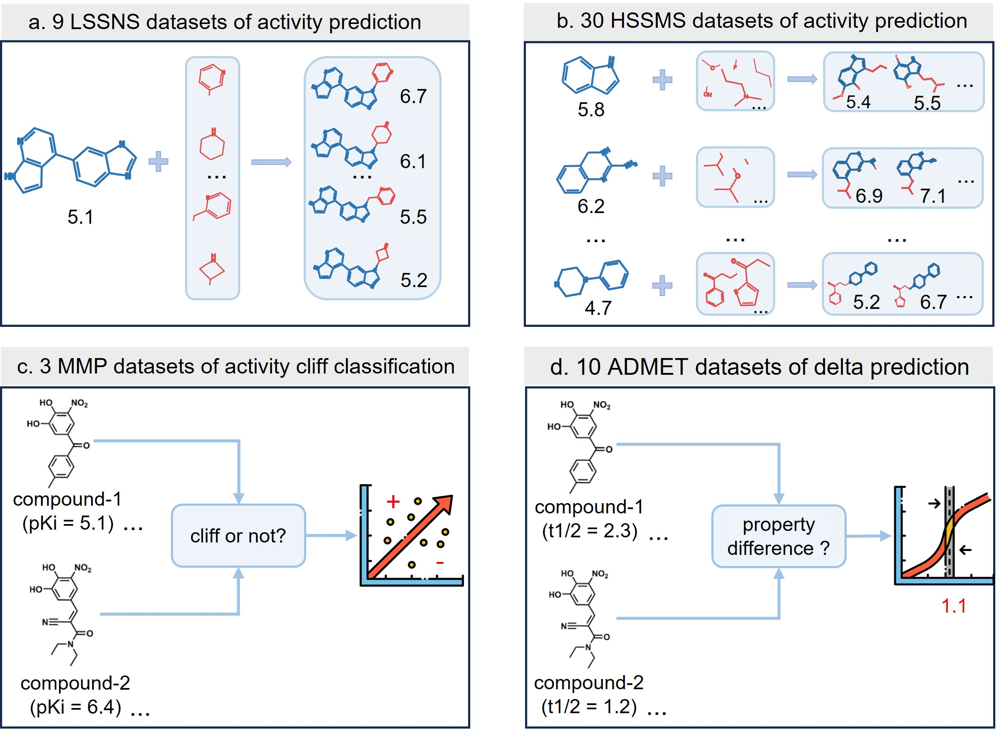

# MPC
## Benchmark datasets of molecular property cliff (MPC) in [ACANet](https://github.com/shenwanxiang/ACANet) paper

------
### Overview of the MPC benchmark datasets 

### 1. The 9 datasets of low sample size and narrow scaffolds (LSSNS) for molecular activity prediction [LSSNS](https://bidd-group.github.io/MPCD/dataset/LSSNS/info/LSSNS.html)

| Idx | dataset   | target                                  | target_type   |   size | reference                                   |
|---:|:----------|:----------------------------------------|:--------------|-------:|:--------------------------------------------|
|  1 | [usp7](https://bidd-group.github.io/MPCD/dataset/LSSNS/info/usp7.html)      | Ubiquitin carboxyl-terminal hydrolase 7 | Protease      |     45 | CHEMBL4251701                               |
|  2 | [rip2](https://bidd-group.github.io/MPCD/dataset/LSSNS/info/rip2.html)      | Serine/threonine-protein kinase RIPK2   | Kinase        |     46 | CHEMBL4266012; CHEMBL4130524                |
|  3 | [pkci](https://bidd-group.github.io/MPCD/dataset/LSSNS/info/pkci.html)      | Protein kinase C iota                   | Kinase        |     48 | CHEMBL4184321                               |
|  4 | [phgdh](https://bidd-group.github.io/MPCD/dataset/LSSNS/info/phgdh.html)     | D-3-phosphoglycerate dehydrogenase      | Other Enzyme  |     51 | CHEMBL4373702                               |
|  5 | [plk1](https://bidd-group.github.io/MPCD/dataset/LSSNS/info/plk1.html)      | Serine/threonine-protein kinase PLK1    | Kinase        |     73 | CHEMBL4406868; CHEMBL4138231                |
|  6 | [ido1](https://bidd-group.github.io/MPCD/dataset/LSSNS/info/ido1.html)      | Indoleamine 2,3-dioxygenase             | Other Enzyme  |     78 | CHEMBL4364294                               |
|  7 | [rxfp1](https://bidd-group.github.io/MPCD/dataset/LSSNS/info/rxfp1.html)     | Relaxin receptor 1                      | GPCR          |    117 | CHEMBL3714716                               |
|  8 | [braf](https://bidd-group.github.io/MPCD/dataset/LSSNS/info/braf.html)      | Serine/threonine-protein kinase B-raf   | Kinase        |    128 | CHEMBL3638563                               |
| 9 | [mglur2](https://bidd-group.github.io/MPCD/dataset/LSSNS/info/mglur2.html)    | Metabotropic glutamate receptor 2       | GPCR          |    244 | CHEMBL3886984                               |

### 2.The 30 datasets of high sample size and mixed scaffolds (HSSMS) for molecular activity prediction. Datasets are the molecular activity prediction benchmark datasets that from [MoleculeACE](https://github.com/molML/MoleculeACE) 

| Idx | Dataset          | Code   | Target                                           | Type | Target\_type | Compounds | Cliffs |
| --- | ---------------- | ------ | ------------------------------------------------ | ---- | ------------ | --------- | ------ |
| 1   | [CHEMBL4792\_Ki](https://bidd-group.github.io/MPCD/dataset/HSSMS/MoleculeACE_benchmark/space/info/CHEMBL4792_Ki.html)   | OX2R   | Orexin receptor 2                                | Ki   | GPCR         | 1471      | 763    |
| 2   | [CHEMBL4616\_EC50](https://bidd-group.github.io/MPCD/dataset/HSSMS/MoleculeACE_benchmark/space/info/CHEMBL4616_EC50.html) | GHSR   | Ghrelin receptor                                 | EC50 | GPCR         | 682       | 330    |
| 3   | [CHEMBL244\_Ki](https://bidd-group.github.io/MPCD/dataset/HSSMS/MoleculeACE_benchmark/space/info/CHEMBL244_Ki.html)    | FX     | Coagulation factor X                             | Ki   | Protease     | 3097      | 1350   |
| 4   | [CHEMBL237\_EC50](https://bidd-group.github.io/MPCD/dataset/HSSMS/MoleculeACE_benchmark/space/info/CHEMBL237_EC50.html)  | KOR    | Kappa opioid receptor                            | EC50 | GPCR         | 955       | 400    |
| 5   | [CHEMBL3979\_EC50](https://bidd-group.github.io/MPCD/dataset/HSSMS/MoleculeACE_benchmark/space/info/CHEMBL3979_EC50.html) | PPARd  | Peroxisome proliferator-activated receptor delta | EC50 | NR           | 1125      | 467    |
| 6   | [CHEMBL239\_EC50](https://bidd-group.github.io/MPCD/dataset/HSSMS/MoleculeACE_benchmark/space/info/CHEMBL239_EC50.html)  | PPARa  | Peroxisome proliferator-activated receptor alpha | EC50 | NR           | 1721      | 709    |
| 7   | [CHEMBL234\_Ki](https://bidd-group.github.io/MPCD/dataset/HSSMS/MoleculeACE_benchmark/space/info/CHEMBL234_Ki.html)   | D3R    | Dopamine D3 receptor                             | Ki   | GPCR         | 3657      | 1441   |
| 8   | [CHEMBL2047\_EC50](https://bidd-group.github.io/MPCD/dataset/HSSMS/MoleculeACE_benchmark/space/info/CHEMBL2047_EC50.html) | FXR    | Farnesoid X receptor                             | EC50 | NR           | 631       | 245    |
| 9   | [CHEMBL219\_Ki](https://bidd-group.github.io/MPCD/dataset/HSSMS/MoleculeACE_benchmark/space/info/CHEMBL219_Ki.html)    | D4R    | Dopamine D4 receptor                             | Ki   | GPCR         | 1859      | 715    |
| 10  | [CHEMBL264\_Ki](https://bidd-group.github.io/MPCD/dataset/HSSMS/MoleculeACE_benchmark/space/info/CHEMBL264_Ki.html)    | HRH3   | Histamine H3 receptor                            | Ki   | GPCR         | 2862      | 1084   |
| 11  | [CHEMBL235\_EC50](https://bidd-group.github.io/MPCD/dataset/HSSMS/MoleculeACE_benchmark/space/info/CHEMBL235_EC50.html)  | PPARy  | Peroxisome proliferator-activated receptor gamma | EC50 | NR           | 2349      | 881    |
| 12  | [CHEMBL236\_Ki](https://bidd-group.github.io/MPCD/dataset/HSSMS/MoleculeACE_benchmark/space/info/CHEMBL236_Ki.html)    | DOR    | Delta opioid receptor                            | Ki   | GPCR         | 2598      | 965    |
| 13  | [CHEMBL4005\_Ki](https://bidd-group.github.io/MPCD/dataset/HSSMS/MoleculeACE_benchmark/space/info/CHEMBL4005_Ki.html)   | PIK3CA | PI3-kinase p110-alpha subunit                    | Ki   | Transferase  | 960       | 351    |
| 14  | [CHEMBL218\_EC50](https://bidd-group.github.io/MPCD/dataset/HSSMS/MoleculeACE_benchmark/space/info/CHEMBL218_EC50.html)  | CB1    | Cannabinoid receptor 1                           | EC50 | GPCR         | 1031      | 367    |
| 15  | [CHEMBL237\_Ki](https://bidd-group.github.io/MPCD/dataset/HSSMS/MoleculeACE_benchmark/space/info/CHEMBL237_Ki.html)    | KOR    | Kappa opioid receptor                            | Ki   | GPCR         | 2602      | 941    |
| 16  | [CHEMBL204\_Ki](https://bidd-group.github.io/MPCD/dataset/HSSMS/MoleculeACE_benchmark/space/info/CHEMBL204_Ki.html)    | F2     | Thrombin                                         | Ki   | Protease     | 2754      | 989    |
| 17  | [CHEMBL214\_Ki](https://bidd-group.github.io/MPCD/dataset/HSSMS/MoleculeACE_benchmark/space/info/CHEMBL214_Ki.html)    | 5-HT1A | Serotonin 1a receptor                            | Ki   | GPCR         | 3317      | 1147   |
| 18  | [CHEMBL228\_Ki](https://bidd-group.github.io/MPCD/dataset/HSSMS/MoleculeACE_benchmark/space/info/CHEMBL228_Ki.html)    | SERT   | Serotonin transporter                            | Ki   | Other        | 1704      | 599    |
| 19  | [CHEMBL287\_Ki](https://bidd-group.github.io/MPCD/dataset/HSSMS/MoleculeACE_benchmark/space/info/CHEMBL287_Ki.html)    | SOR    | Sigma opioid receptor                            | Ki   | Other        | 1328      | 464    |
| 20  | [CHEMBL233\_Ki](https://bidd-group.github.io/MPCD/dataset/HSSMS/MoleculeACE_benchmark/space/info/CHEMBL233_Ki.html)    | MOR    | u-opioid receptor                                | Ki   | GPCR         | 3142      | 1111   |
| 21  | [CHEMBL2147\_Ki](https://bidd-group.github.io/MPCD/dataset/HSSMS/MoleculeACE_benchmark/space/info/CHEMBL2147_Ki.html)   | PIM1   | Serine/threonine-protein kinase PIM1             | Ki   | Kinase       | 1456      | 485    |
| 22  | [CHEMBL1862\_Ki](https://bidd-group.github.io/MPCD/dataset/HSSMS/MoleculeACE_benchmark/space/info/CHEMBL1862_Ki.html)   | ABL1   | Tyrosine-protein kinase ABL1                     | Ki   | Kinase       | 794       | 253    |
| 23  | [CHEMBL2034\_Ki](https://bidd-group.github.io/MPCD/dataset/HSSMS/MoleculeACE_benchmark/space/info/CHEMBL2034_Ki.html)   | GR     | Glucocorticoid receptor                          | Ki   | NR           | 750       | 230    |
| 24  | [CHEMBL238\_Ki](https://bidd-group.github.io/MPCD/dataset/HSSMS/MoleculeACE_benchmark/space/info/CHEMBL238_Ki.html)    | DAT    | Dopamine transporter                             | Ki   | Other        | 1052      | 263    |
| 25  | [CHEMBL1871\_Ki](https://bidd-group.github.io/MPCD/dataset/HSSMS/MoleculeACE_benchmark/space/info/CHEMBL1871_Ki.html)   | AR     | Androgen Receptor                                | Ki   | NR           | 659       | 157    |
| 26  | [CHEMBL231\_Ki](https://bidd-group.github.io/MPCD/dataset/HSSMS/MoleculeACE_benchmark/space/info/CHEMBL231_Ki.html)    | HRH1   | Histamine H1 receptor                            | Ki   | GPCR         | 973       | 224    |
| 27  | [CHEMBL262\_Ki](https://bidd-group.github.io/MPCD/dataset/HSSMS/MoleculeACE_benchmark/info/CHEMBL262_Ki.html)    | GSK3   | Glycogen synthase kinase-3 beta                  | Ki   | Kinase       | 856       | 158    |
| 28  | [CHEMBL2971\_Ki](https://bidd-group.github.io/MPCD/dataset/HSSMS/MoleculeACE_benchmark/space/info/CHEMBL2971_Ki.html)   | JAK2   | Janus kinase 2                                   | Ki   | Kinase       | 976       | 120    |
| 29  | [CHEMBL4203\_Ki](https://bidd-group.github.io/MPCD/dataset/HSSMS/MoleculeACE_benchmark/space/info/CHEMBL4203_Ki.html)   | CLK4   | Dual specificity protein kinase CLK4             | Ki   | Kinase       | 731       | 64     |
| 30  | [CHEMBL2835\_Ki](https://bidd-group.github.io/MPCD/dataset/HSSMS/MoleculeACE_benchmark/space/info/CHEMBL2835_Ki.html)   | JAK1   | Janus kinase 1                                   | Ki   | Kinase       | 615       | 46     |

### 3. The 3 matched molecular pair (MMP) datasets of activity cliff classification. Datasets are from [ACGCN](https://github.com/chunkyun/ACGCN) 
| Dataset                 | Total Compounds | Total MMPs | MMP-Cliffs | MMP-nonCliffs |
|-------------------------|-----------------|------------|------------|---------------|
| Thrombin                | 3171            | 5751       | 317        | 4408          |
| Mu opioid receptor      | 3625            | 8725       | 219        | 7097          |
| Melanocortin receptor 4 | 1858            | 7169       | 111        | 5750          |

### 4. The 10 datasets of ADMET properties in delta prediction. Datasets are from [DeepDelta](https://github.com/RekerLab/DeepDelta) 

| Dataset                               | Property     | Size | Units                                      |
|---------------------------------------|--------------|------|--------------------------------------------|
| Free Solvation                        | Absorption   | 642  | Experimental Hydration Free Energy in Water |
| Caco2                                 | Absorption   | 910  | Log(Papp)                                  |
| Aqueous Solubility                    | Absorption   | 1128 | LogS                                       |
| Fraction Unbound, Brain               | Distribution | 253  | Log(fu,brain)                              |
| Volume of Distribution at Steady State| Distribution | 1130 | Log(Body/Blood Concentration in L/kg)      |
| Renal Clearance                       | Excretion    | 636  | Log(CLr)                                   |
| Microsomal Clearance                  | Metabolism   | 731  | Log(mL/min/kg cleared)                     |
| Hepatic Clearance                     | Metabolism   | 881  | Log(mL/min/kg cleared)                     |
| Half-Life                             | Metabolism   | 1321 | Log(Half-Life in Hours)                    |
| Hemolytic Toxicity                    | Toxicity     | 828  | Log(HD50)                                  |

